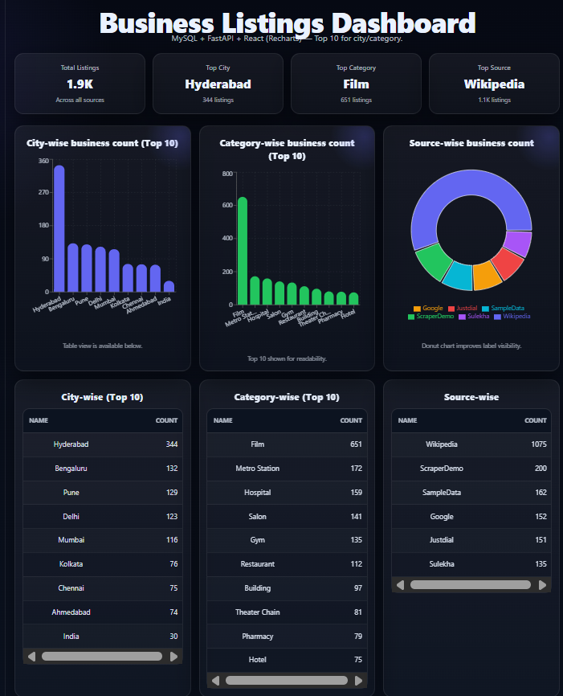
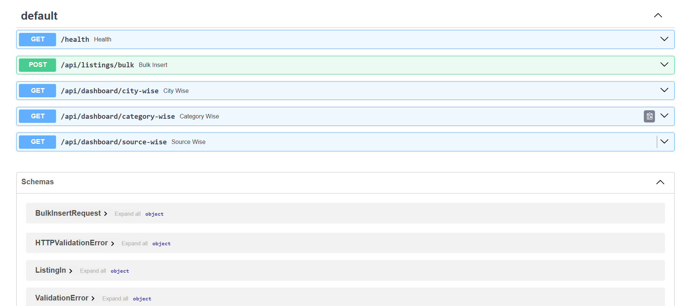

# Business Listings Dashboard (React + FastAPI + MySQL)

## Objective
A full‑stack, data‑driven dashboard that stores and visualizes business listings and shows aggregated reports:
- City‑wise business count
- Category‑wise business count
- Source‑wise business count

**Frontend:** React (Vite) + Recharts  
**Backend:** FastAPI (Python)  
**Database:** MySQL

## Sample Work Pictures
  


---

## Features
- Bulk insert business listings into MySQL using a FastAPI endpoint
- Dashboard APIs for aggregated counts:
  - City-wise count
  - Category-wise count
  - Source-wise count
- React dashboard UI showing charts + table view
- Seed script to insert **500+** (currently 600) sample listings
- Wikipedia multi-page scraper to insert **1000+ real entries** (idempotent; safe to rerun)

---

## Tech Stack
- React.js (Vite)
- FastAPI (Python)
- MySQL
- SQLAlchemy + PyMySQL
- Recharts

---

## Folder Structure
```
business-listings-dashboard/
  backend/
    main.py
    database.py
    models.py
    schemas.py
    seed_data.py
    wiki_multi_scraper.py
    requirements.txt
    .env.example
  frontend/
    src/
      App.jsx
      Dashboard.jsx
      Dashboard.css
      api.js
  db_dump.sql
  README.md
```

---

## Setup Instructions

### 1) Prerequisites
Install:
- Node.js (LTS recommended)
- Python 3.10+
- MySQL Community Server

Verify:
```bash
node -v
npm -v
python --version
mysql --version
```

---

## 2) Database Setup (MySQL)

Login:
```bash
mysql -u root -p
```

Run:
```sql
CREATE DATABASE IF NOT EXISTS business_dashboard;
USE business_dashboard;

CREATE TABLE IF NOT EXISTS listing_master (
  id BIGINT AUTO_INCREMENT PRIMARY KEY,
  business_name VARCHAR(255) NOT NULL,
  category VARCHAR(255) NOT NULL DEFAULT '',
  city VARCHAR(100) NOT NULL DEFAULT '',
  address TEXT,
  phone VARCHAR(50),
  source VARCHAR(50) NOT NULL DEFAULT '',
  created_at TIMESTAMP DEFAULT CURRENT_TIMESTAMP
);

-- Prevent duplicates (idempotent scraping / bulk inserts)
ALTER TABLE listing_master
ADD CONSTRAINT uq_listing_dedupe
UNIQUE (business_name, category, city, source);

CREATE INDEX idx_city ON listing_master(city);
CREATE INDEX idx_category ON listing_master(category);
CREATE INDEX idx_source ON listing_master(source);
```

> Note: If you already have duplicates, remove duplicates before adding the UNIQUE constraint.

---

## 3) Backend Setup (FastAPI)

### Create and activate venv
```bash
cd backend
python -m venv .venv
```

Activate:
- Windows (PowerShell):
  ```bash
  .\.venv\Scripts\Activate.ps1
  ```
- macOS/Linux:
  ```bash
  source .venv/bin/activate
  ```

### Install dependencies
```bash
pip install -r requirements.txt
```

### Configure environment variables
Copy `.env.example` to `.env` and update values:

macOS/Linux:
```bash
cp .env.example .env
```

Windows (PowerShell):
```powershell
Copy-Item .env.example .env
```

### Run backend
```bash
uvicorn main:app --reload --port 8000
```

Open:
- Health: http://127.0.0.1:8000/health
- Swagger Docs: http://127.0.0.1:8000/docs

---

## 4) Insert 500+ Listings (Seed Data)
From `backend/` (with backend running in another terminal):
```bash
python seed_data.py
```

Expected output:
```json
{"inserted": 600}
```

---

## 5) Wikipedia Scraping (1000+ real records)
From `backend/` (with backend running in another terminal):
```bash
python wiki_multi_scraper.py
```

Expected output (example):
```text
Total unique listings: 1075
Inserted: {'inserted': 1075, 'received': 1075}
```

Re-running is safe:
```text
Inserted: {'inserted': 0, 'received': 1075}
```

---

## 6) Frontend Setup (React)
```bash
cd frontend
npm install
npm run dev
```

Open:
- http://localhost:5173

---

## API Endpoints
- GET `/health`
- POST `/api/listings/bulk`
- GET `/api/dashboard/city-wise`
- GET `/api/dashboard/category-wise`
- GET `/api/dashboard/source-wise`

---

## How to Generate Database Dump (Optional)
```bash
mysqldump -u root -p business_dashboard > db_dump.sql
```

---

## License
For internship assessment.
